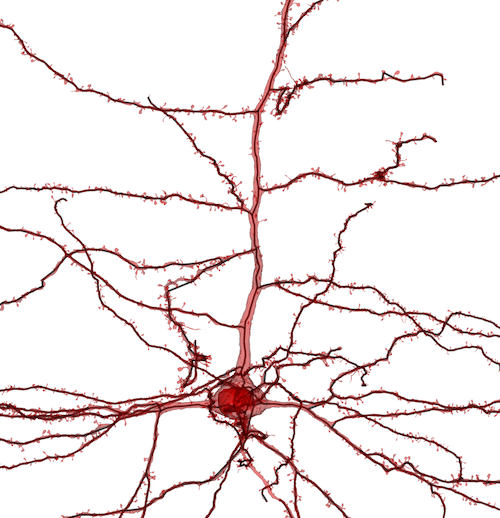

[](https://doi.org/10.5281/zenodo.7703278)

# pcg_skel

Generate robust neuronal topology directly from PyChunkedGraph dynamic segmentations.

Skeletonization is an essential part of measuring neuronal anatomy, but in 3d segmented data it is not always trivial to produce a skeleton.
Segmentations and meshes are often prohibitively large to download *en mass* and can artifacts that generate ambiguities or make attaching annotations like synapses to specific locations unclear.

PCG-skel uses the same chunking that allows the [PyChunkedGraph](https://github.com/seung-lab/PyChunkedGraph) (PCG) to quickly make edits to large, complex neuronal segmentations and, combined with a dynamic caching system that updates after every edit, can generate complete representations of the topology of objects in just a few seconds and minimal data downloads.
Becuase the data is always matched to the underlying representation of the segmentation, there are no ambiguities in what parts are connected to what other or in which vertex a synapse or other annotation is associated with.
This light data needs and rapid skeletonization make it useful in environments where analysis is being re-run on frequently changing cells.

However, there is a trade-off in terms of resolution.
The dependency on chunk size means that vertices are roughly a chunk width apart, which in current datasets amounts to about 2 microns.
Thus for understanding the overall structure of a cell or looking at long distance relationships between points along an arbor, these skeletons are quite good, but for detailed analysis at short length scales (0-10 microns or so) where being plus or minus a micron would hurt analysis, I recommend looking at other approaches like kimimaro, meshteasar, or CGAL skeletonization.


## Example of usage

It is highly recommended to run PCGSkel with a [CAVE client](https://caveclient.readthedocs.io/).

The most basic way to get a skeleton requires only a root id and CAVEclient.

```python
from caveclient import CAVEclient
import pcg_skel

client = CAVEclient('minnie65_phase3_v1')
root_id = 864691135867734294
sk = pcg_skel.coord_space_skeleton(root_id, client)
```

This generates a skeleton, in this case for a pyramidal cell in the MICrONs65 volume, in just a few seconds — less time than is needed to download the mesh itself. The skeleton is shown in black, and the mesh in red.



## What you need

PCG-skel requires an active [PyChunkedGraph](https://github.com/seung-lab/PyChunkedGraph) server.

For best performance, your dataset should have an L2 Cache, a service that caches representive points and features for every chunk.
Using the CAVEclient, you can test for this by running `client.l2cache.attributes`.
If you get a list of attribute names back, you're good!
If you don't have an L2 cache and still want to use PCG Skel, see the section below `How to use without an L2 Cache`.

To also use annotations, you also need a database backend running the [MaterializationEngine](https://github.com/seung-lab/MaterializationEngine).

## Key terms

Ids in the PCG combine information about chunk level, spatial location, and unique object id.
This package uses the highest-resolution chunking, level 2, to derive neuronal topology and approximate spatial extent.
For clarity, I'll define a few terms:

* *Level 2 chunk*: A box defining a unit of data storage and representation. The entire dataset is tiled by nonoverlapping chunks. Each chunk has properties like a detailed graph of which supervoxels touch what other supervoxels, meshes associated with each segmented object inside the chunk, etc. By chunking the data and agglomerating larger objects out of these chunks, edits only have to touch those few chunks that actually change during proofreading, reducing the amount of memory and effort needed to process them.

Chunks can exist at many scales, but "level 2" refers to the lowest level of chunking (level 1 refers to the supervoxels themselves).

* *Level 2 id (L2 id)*: A segmentation id that describes the state of the segmentation inside a given L2 chunk.
Note that if two distinct parts of the same neuron enter the same chunk, each has its own level 2 id.

* *Level 2 graph*: Each level 2 id can be thought of as connected to level 2 ids in other chunks when an object's supervoxels run across chunk boundaries or where edges have introduced by merges during proofreading. The graph of which level 2 ids are connected to which others is called the "level 2 graph." Keeping track of the level 2 graph is one of the jobs of the PCG.

* *Level 2 skeleton*: A reduced version of the level 2 graph that is tree-like.

* *Representitative point*: For each level 2 id, the L2 Cache determines a representative point that is guaranteed to be within the segmentation and is located at a "most central" point in the segmentation of the L2 id.

## How to use

There are three main functions to generate a neuronal representation from the pychunkedgraph and L2 Cache that build on one another. One gets the L2 graph, one processes it into an L2 skeleton, and a third collects the graph and skeleton together into a "Meshwork" object that can also handle annotations.

### Skeletons

This function will return a meshparty Skeleton class. Skeleton features can be found in the [Meshparty documentation](https://meshparty.readthedocs.io/en/latest/).

```python
def coord_space_skeleton(
    root_id,
    client,
    cv=None,
    invalidation_d=10_000,
    return_mesh=False,
    return_l2dict=False,
    return_l2dict_mesh=False,
    root_point=None,
    root_point_resolution=None,
    collapse_soma=False,
    collapse_radius=7500,
):
```

The basic use requires only a root id and a caveclient, but there are a number of important options.

* *cv*: Passing an initialized cloudvolume object (`cv=`) can save a second or two per skeleton. This isn't a big deal for a couple of skeletons, but may save some real time if you are creating a large number of skeletons.

* *invalidation_d*: The invalidation distance for skeletonization, in nanometers. This parameter sets the distance at which vertices of the graph are collapsed into a branch. Too big and branches might be missed, but too small and false branches might be added to thick processes. This is an important parameter to customize for your data, since different morphologies will be best represented by different values. The default value works well for cortical neurons, for example, but is probably too coarse for fly neurons.

* *return_mesh*, *return_l2dict*, *return_l2dict_mesh*: These three values are all set to False by default, which is fine if you just want a skeleton. However, if you want to map vertices to level 2 ids or skeleton vertices back to the mesh graph, these options can give you the mesh and dictionaries mapping vertices to the l2 ids for the skeletons and the mesh graph.

* *root_point*, *root_point_resolution*: Setting a root point defines the root of the skeleton, which establishes an orientation for the skeleton. Root point is an x,y,z position, and the resolution is the value in nm of the resolution of coordinates (also in x,y,z, resolution). If the point is from neuroglancer or an annotation table, take careful note of the resolution. 

* *collapse_soma*, *collapse_radius*: These two options let you collapse vertices around a soma into the root point. Setting collapse_soma to True will collapse all vertices within the collapse radius (in nanometers) into the root point. Additionally, the root point is added as a new skeleton vertex. Again, the default value works for most cortical neurons, but cells with larger or smaller cell bodies might need different values.


### Mesh graph

This function will return a meshparty Mesh object, with a vertex at the representative point for every l2 id and edges where they connect to one another.
Such a mesh is what the skeleton returned above is generated from.

```python
def coord_space_mesh(
    root_id,
    client,
    cv=None,
    return_l2dict=False,
):
```

There are fewer options, since the mesh graph is a more direct representation of the data.

### Meshwork file

Meshwork files combine the mesh graph, the skeleton, and annotations linked together. They are more complex objects, but can be useful for a number of tasks and analyses.

```python
def coord_space_meshwork(
    root_id,
    datastack_name=None,
    client=None,
    cv=None,
    root_point=None,
    root_point_resolution=None,
    collapse_soma=False,
    collapse_radius=7500,
    synapses=None,
    synapse_table=None,
    remove_self_synapse=True,
    live_query=False,
    timestamp=None,
    invalidation_d=7500,
):
```

Many of the parameters are the same as in skeletonization. In addition, there are parameters controlling the addition of synapses.

* *synapses*: If set to `"pre"`, `"post"`, or `"all"`, the after skeletonization the system will add pre, post, or both pre and postsynaptic annotations using the specified synapse table to the meshwork under `nrn.anno.pre_syn` and `nrn.anno.post_syn` respectively. Note that by default, `remove_self_synapse` will omit all synapses whose pre and post ids are the same neuron. This is a common form of errors, particularly around the nucleus, although it can also remove biologically real autapses. `synapse_table` denotes the name of the table to search for these tables, for instance, you might use `client.materialize.synapse_table`.

* *live_query*, *timestamp*: If live_query is True, sets the timestamp at which annotations are from. If not set, uses the materialization defined in the caveclient.


## How to use without an L2 Cache

See the `nocache.md` file for instructions on how to use without a L2 cache for the chunkedgraph.

## Credit

This work is by Casey Schneider-Mizell (caseys@alleninstitute.org) with suggestions from Sven Dorkenwald and Forrest Collman.
