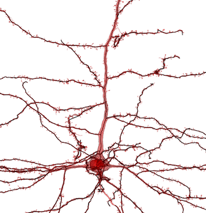

{ align=right }

`pcg_skel` is a package used to rapidly build neuronal skeletons from electron microscopy data in the [CAVE ecosystem](https://github.com/CAVEconnectome).
It integrates structural data, connectivity data, and local features stored across many aspects of a CAVE system, and creates objects as [MeshParty](https://meshparty.readthedocs.io/en/latest/) meshes, skeletons, and MeshWork files for subsequent analysis.
By harnessing the way the structural data is stored, you can build skeletons for even very large neurons quickly and with little memory use.


## Installation

To install `pcg_skel`, just use pip. The package is available for python 3.9 and above.

```bash
pip install pcg_skel
```

## Installing from Source (for Developers)

To install `pcg_skel` from source, you can clone the repository and install it using pip.

```bash
pip install -e .
```

`pcg_skel` uses [uv](https://docs.astral.sh/uv/) for packaging, and there are tests that can be run within the environment using [poe](https://poethepoet.natn.io)

```bash
poe test
```

which aliases `uv run pytest --cov=pcg_skel tests`.

## Related Packages

### MeshParty

`pcg_skel` uses [MeshParty](https://meshparty.readthedocs.io/en/latest/) for skeletonization and mesh processing, and relies on algorithms and data classes defined there.

### CAVEclient

`pcg_skel` uses the [CAVEclient](https://caveclient.readthedocs.io/en/latest/) to access data stored in the CAVE ecosystem.

### SkeletonPlot

[SkeletonPlot](https://github.com/AllenInstitute/skeleton_plot) can be used to visualize skeletons generated by `pcg_skel`.